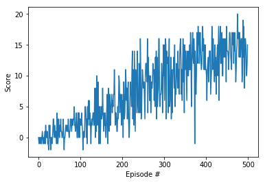

# Report

## Learning Algorithm

### DQN
Hyperparameters in `code/dqn_agent.py`

- `BUFFER_SIZE` = int(1e5)
	- replay buffer size
- `BATCH_SIZE` = 64
	- minibatch size
- `GAMMA` = 0.99
	- discount factor
- `TAU` = 1e-3
	- for soft update of target parameters
- `LR` = 5e-4
	- learning rate 
- `UPDATE_EVERY` = 4
	- how often to update the network
		
Hyperparameters in `code/Navigation.ipynb`
- `eps_start` = 1.0
	- start epsilon value of the ε-greedy
- `eps_end` = 0.1
	- end epsilon value of the ε-greedy
- `eps_decay` = 0.995
	- epsilon decay rate of the ε-greedy

### NN Model Architecture
NN model consists of 3 `torch.nn.Linear` layers, and the activation functions of the 1st and 2nd layers are `torch.nn.functional.relu`.
- input shape: `(37,)`
- output shape: `(4,)`
- (The first argument value of the shape shown below indicates the batch size.)

```
----------------------------------------------------------------
        Layer (type)               Output Shape         Param #
================================================================
            Linear-1                   [64, 64]           2,432
            Linear-2                   [64, 64]           4,160
            Linear-3                    [64, 4]             260
================================================================
```

For this project, you will train an agent to navigate (and collect bananas!) in a large, square world.  
The goal of your agent is to collect as many yellow bananas as possible while avoiding blue bananas.  

## Plot of Rewards
Environment solved in 500 episodes!
- Average Score: 13.41



## Ideas for Future Work
In this project, DQN consisting of a very simple neural network was used. You might consider using more advanced algorithms like Double DQN, increasing the neural network depth to increase capacity, or using Prioritized Replay to use the experience more efficiently to improve agent's performance.